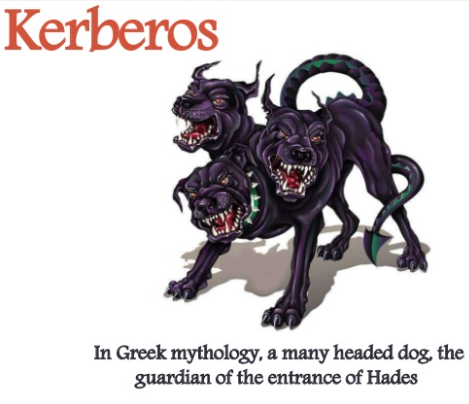
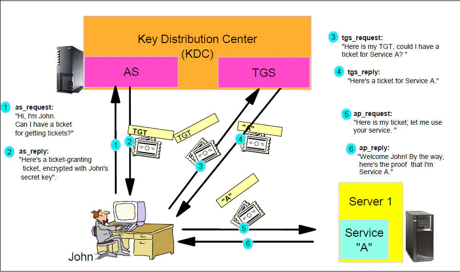
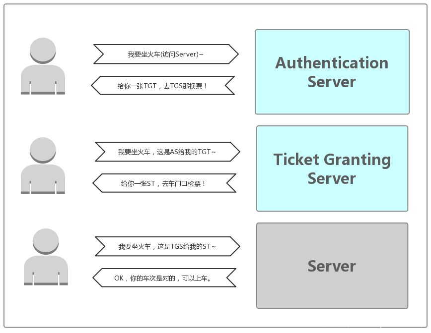
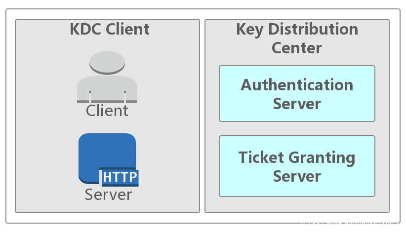

# kerberos协议及工具学习





Kerberos（/ˈkərbərəs/）是一种由MIT（麻省理工大学）提出的一种网络身份验证协议。它旨在通过使用密钥加密技术为客户端/服务器应用程序提供强身份验证。

这个协议以希腊神话中的人物**Kerberos（或者Cerberus）**命名，他在希腊神话中是Hades的一条凶猛的**三头保卫神犬**。

软件设计上采用客户端/服务器结构，并且能够进行相互认证，即客户端和服务器端均可对对方进行身份认证。可以用于防止窃听、防止重放攻击、保护数据完整性等场合，是一种应用对称密钥体制进行密钥管理的系统。

Kerberos的扩展产品也使用公开密钥加密方法进行认证。当有N个人使用该系统时，为确保在任意两个人之间进行秘密对话，系统至少保存有它与每个人的共享密钥，所需的最少会话密钥数为N个。

## 本仓库内容

1. kerberos协议及工具学习


```
Something I hope you know before go into the coding ~
First, please watch or star this repo, I'll be more happy if you follow me.
Bug report, questions and discussion are welcome, you can post an issue or pull a request.
```

## 相关站点

* 官网: <https://web.mit.edu/kerberos/>
* wiki: <https://en.wikipedia.org/wiki/Kerberos_(protocol)>


## 目录


* [keberos协议](docs/keberos协议.md)
    * [白话文举栗子讲故事入门介绍](docs/keberos协议/白话文举栗子讲故事入门介绍.md)
    * [红帽文档之kerberos](docs/keberos协议/红帽文档之kerberos.md)
* [keberos部署](docs/keberos部署.md)
    * [Fedora34部署keberos server](docs/keberos部署/Fedora34.md)


## 经典图示







---
