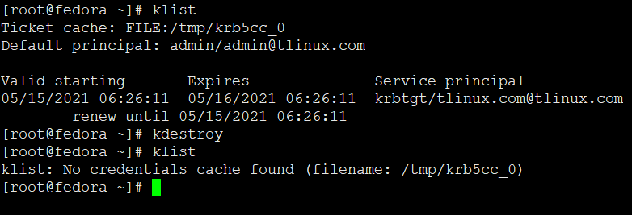

# 客户端常用操作

## 登陆获取身份认证，必须输入密码

```
kinit user1

kinit youyifeng@tlinux.com
```

如果不加域名，则使用/etc/krb5.conf中的default realms


## 查看当前用户的认证信息ticket

```
klist
```



如果有的话，没有就会报错

## 清除所有认证信息

```
kdestroy
```

```
Usage: kdestroy [-A] [-q] [-c cache_name] [-p princ_name]
	-A destroy all credential caches in collection
	-q quiet mode
	-c specify name of credentials cache
	-p specify principal name within collection
```


## 登陆操作数据库

* 必须要先登录，且是admin/admin才能操作数据库
* 一般普通用户不能操作，除非授权

```
[root@cdh-server-1 /]# kinit admin/admin
Password for admin/admin@EXAMPLE.COM:
[root@cdh-server-1 /]# kadmin
Authenticating as principal admin/admin@EXAMPLE.COM with password.
Password for admin/admin@EXAMPLE.COM:
kadmin:
```

还有一个命令叫admin.local

**登录到管理员账户，如果在admin所在主机为当前机器，可以通过kadmin.local直接登录，是免密登陆**

```
[root@cdh-node-1 /]# kadmin.local
Authenticating as principal root/admin@EXAMPLE.COM with password.
kadmin.local:
```

kadmin终端详细操作查看服务端常用操作

---
