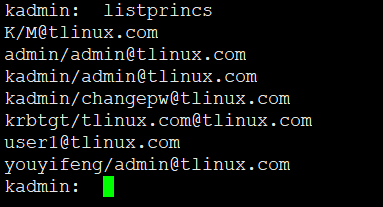
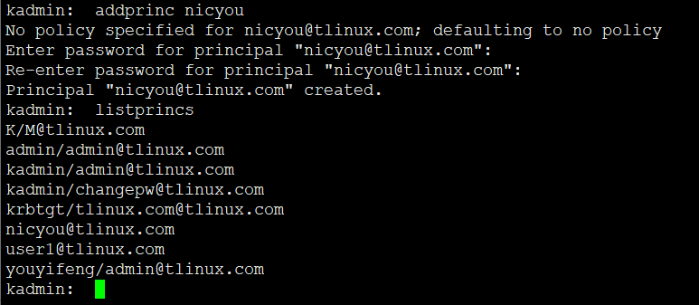
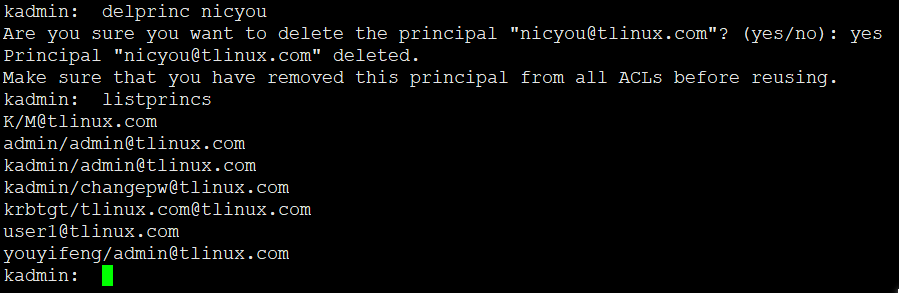

<!-- MDTOC maxdepth:6 firsth1:1 numbering:0 flatten:0 bullets:1 updateOnSave:1 -->

- [服务端常用操作](#服务端常用操作)   
   - [作为管理员登陆](#作为管理员登陆)   
   - [kamdin命令](#kamdin命令)   
   - [listprinc列出所有用户](#listprinc列出所有用户)   
   - [addprincc增加用户](#addprincc增加用户)   
   - [delprinc删除用户](#delprinc删除用户)   

<!-- /MDTOC -->
# 服务端常用操作


## 作为管理员登陆

1. 若是在server机器

直接登录，若之前配置免密，则不用输入密码直接登录

```
kadmin.local
```

2. 客户端机器

需要以admin属组登陆，如此才能是管理员，否则就是普通用户

```
[root@cdh-server-1 /]# kinit admin/admin
Password for admin/admin@EXAMPLE.COM:
[root@cdh-server-1 /]# kadmin
Authenticating as principal admin/admin@EXAMPLE.COM with password.
Password for admin/admin@EXAMPLE.COM:
kadmin:
```

## kamdin命令

```
Available kadmin requests:

add_principal, addprinc, ank
                         Add principal
delete_principal, delprinc
                         Delete principal
modify_principal, modprinc
                         Modify principal
rename_principal, renprinc
                         Rename principal
change_password, cpw     Change password
get_principal, getprinc  Get principal
list_principals, listprincs, get_principals, getprincs
                         List principals
add_policy, addpol       Add policy
modify_policy, modpol    Modify policy
delete_policy, delpol    Delete policy
get_policy, getpol       Get policy
list_policies, listpols, get_policies, getpols
                         List policies
get_privs, getprivs      Get privileges
ktadd, xst               Add entry(s) to a keytab
ktremove, ktrem          Remove entry(s) from a keytab
lock                     Lock database exclusively (use with extreme caution!)
unlock                   Release exclusive database lock
purgekeys                Purge previously retained old keys from a principal
get_strings, getstrs     Show string attributes on a principal
set_string, setstr       Set a string attribute on a principal
del_string, delstr       Delete a string attribute on a principal
list_requests, lr, ?     List available requests.
quit, exit, q            Exit program.
```
## listprinc列出所有用户

```
listprincs
```




## addprincc增加用户


```
addprinc 用户名
```



## delprinc删除用户

```
delprinc 用户名
```




---
