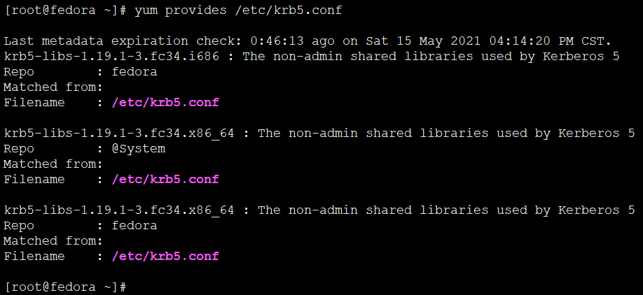
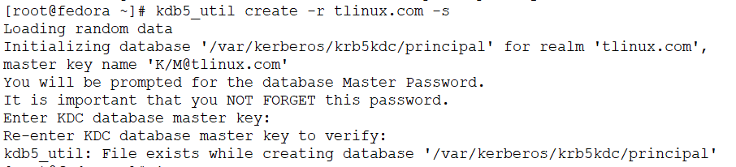
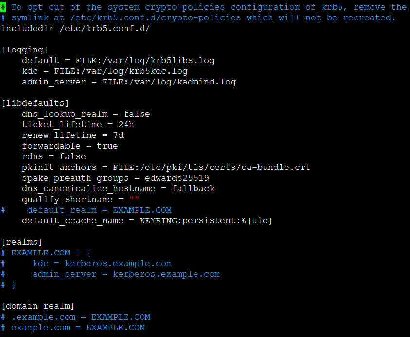
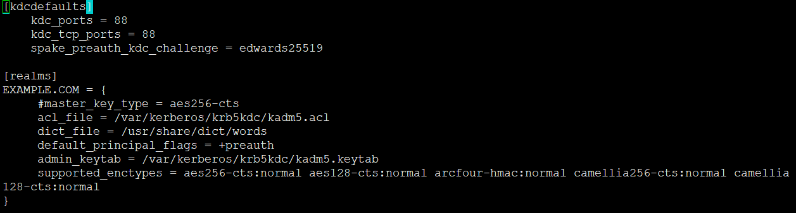
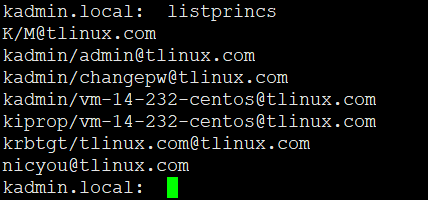
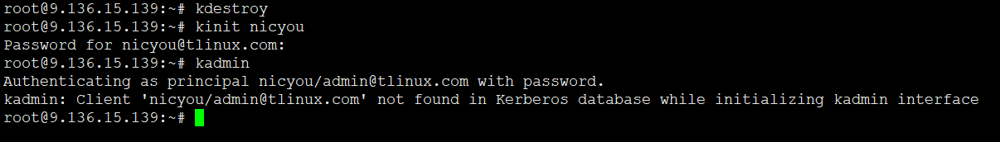
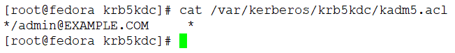

<!-- MDTOC maxdepth:6 firsth1:1 numbering:0 flatten:0 bullets:1 updateOnSave:1 -->

- [Fedora34部署keberos server](#fedora34部署keberos-server)   
   - [keberos相关包](#keberos相关包)   
   - [依赖服务 - 配置 DNS 解析和 NTP 服务](#依赖服务-配置-dns-解析和-ntp-服务)   
   - [服务端配置](#服务端配置)   
   - [客户端配置](#客户端配置)   
   - [使用koji.fedoraproject.org的kerberos](#使用kojifedoraprojectorg的kerberos)   
   - [原始配置](#原始配置)   
   - [/etc/krb5.conf 详解](#etckrb5conf-详解)   
   - [/var/kerberos/krb5kdc/kdc.conf 配置详解](#varkerberoskrb5kdckdcconf-配置详解)   
   - [kadm5.acl 访问控制配置](#kadm5acl-访问控制配置)   
   - [参考](#参考)   

<!-- /MDTOC -->

# Fedora34部署keberos server


## keberos相关包

相关包如下：

```
[root@fedora ~]# yum search krb
Last metadata expiration check: 0:09:30 ago on Sat 15 May 2021 04:14:20 PM CST.
========================================== Name & Summary Matched: krb ==========================================
perl-Authen-Krb5.x86_64 : Krb5 Perl module
samba-winbind-krb5-locator.x86_64 : Samba winbind krb5 locator
=============================================== Name Matched: krb ===============================================
dcap-tunnel-krb.x86_64 : Kerberos tunnel for dCache
freeradius-krb5.x86_64 : Kerberos 5 support for freeradius
golang-github-jcmturner-gokrb5-devel.noarch : Pure Go Kerberos library for clients and services
golang-gopkg-jcmturner-gokrb5-5-devel.noarch : Pure Go Kerberos library for clients and services
golang-gopkg-jcmturner-gokrb5-7-devel.noarch : Pure Go Kerberos library for clients and services
krb5-auth-dialog.x86_64 : Kerberos 5 authentication dialog
krb5-devel.x86_64 : Development files needed to compile Kerberos 5 programs
krb5-devel.i686 : Development files needed to compile Kerberos 5 programs
krb5-libs.x86_64 : The non-admin shared libraries used by Kerberos 5
krb5-libs.i686 : The non-admin shared libraries used by Kerberos 5
krb5-pkinit.x86_64 : The PKINIT module for Kerberos 5
krb5-pkinit.i686 : The PKINIT module for Kerberos 5
krb5-server.x86_64 : The KDC and related programs for Kerberos 5
krb5-server-ldap.x86_64 : The LDAP storage plugin for the Kerberos 5 KDC
krb5-workstation.x86_64 : Kerberos 5 programs for use on workstations
perl-Authen-Krb5-Admin.x86_64 : Perl extension for MIT Kerberos 5 admin interface
php-pecl-krb5.x86_64 : Kerberos authentification extension
php-pecl-krb5-devel.x86_64 : Kerberos extension developer files (header)
python3-krbcontext.noarch : A Kerberos context manager
rubygem-krb5-auth.x86_64 : Kerberos binding for Ruby
samba-krb5-printing.x86_64 : Samba CUPS backend for printing with Kerberos
sssd-krb5.x86_64 : The Kerberos authentication back end for the SSSD
sssd-krb5-common.x86_64 : SSSD helpers needed for Kerberos and GSSAPI authentication
```

其中

1. krb5-workstation 是客户端
2. krb5-server 是服务端

## 依赖服务 - 配置 DNS 解析和 NTP 服务

Kerberos 要求参与通信的主机的时钟同步。票据具有一定有效期，因此，如果主机的时钟与 Kerberos 服务器的时钟不同步，认证会失败。默认设置要求时钟的时间相差不超过 10 分钟。


## 服务端配置


```
yum install -y krb5-libs krb5-server krb5-workstation
```


```
/etc/logrotate.d/kadmind
/etc/logrotate.d/krb5kdc
/etc/sysconfig/kadmin
/etc/sysconfig/kprop
/etc/sysconfig/krb5kdc
/usr/bin/sclient
/usr/lib/systemd/system/kadmin.service
/usr/lib/systemd/system/kprop.service
/usr/lib/systemd/system/krb5kdc.service
/usr/lib/tmpfiles.d/krb5-krb5kdc.conf
/usr/lib64/krb5
/usr/lib64/krb5/plugins
/usr/lib64/krb5/plugins/authdata
/usr/lib64/krb5/plugins/kdb
/usr/lib64/krb5/plugins/kdb/db2.so
/usr/lib64/krb5/plugins/kdb/klmdb.so
/usr/lib64/krb5/plugins/preauth
/usr/lib64/krb5/plugins/preauth/otp.so
/usr/sbin/kadmin.local
/usr/sbin/kadmind
/usr/sbin/kdb5_util
/usr/sbin/kprop
/usr/sbin/kpropd
/usr/sbin/kproplog
/usr/sbin/krb5kdc
/usr/sbin/sserver
/usr/share/doc/krb5-server
/usr/share/doc/krb5-server/kdc.conf
/usr/share/man/man1/sclient.1.gz
...
/var/kerberos
/var/kerberos/krb5kdc
/var/kerberos/krb5kdc/kadm5.acl
/var/kerberos/krb5kdc/kdc.conf
/var/run/krb5kdc

```


| 二进制                 | 功能描述                                                       |
| ---------------------- | -------------------------------------------------------------- |
| /usr/sbin/kadmin.local | Kerberos V5 database administration program                    |
| /usr/sbin/kadmind      | KADM5 administration server                                    |
| /usr/sbin/kdb5_util    | Kerberos database maintenance utility                          |
| /usr/sbin/kprop        | propagate a Kerberos V5 principal database to a replica server |
| /usr/sbin/kpropd       | Kerberos V5 replica KDC update server                          |
| /usr/sbin/kproplog     | display the contents of the Kerberos principal update log      |
| /usr/sbin/krb5kdc      | Kerberos V5 KDC                                                |
| /usr/sbin/sserver      | sample Kerberos version 5 server                               |


但是krb5的配置文件，怎么没在服务包？？不对，是有的，这个文件。为嘛不放到/etc下？？？

* /var/kerberos/krb5kdc/kdc.conf

另外还有一个配置，属于通用配置，就是客户端和服务端都会用到的配置




* 居然放到了lib包，因为客户端krb5-worksataion和krb5-server 服务端都会安装krb5-libs，所以干脆通用配置都放在libs

```
[root@fedora ~]# rpm -ql krb5-libs
/etc/gss
/etc/gss/mech.d
/etc/krb5.conf
/etc/krb5.conf.d
/etc/krb5.conf.d/crypto-policies
/usr/lib64/krb5
/usr/lib64/krb5/plugins
/usr/lib64/krb5/plugins/authdata
/usr/lib64/krb5/plugins/kdb
/usr/lib64/krb5/plugins/libkrb5
/usr/lib64/krb5/plugins/preauth
/usr/lib64/krb5/plugins/preauth/spake.so
/usr/lib64/krb5/plugins/tls
/usr/lib64/krb5/plugins/tls/k5tls.so
/usr/lib64/libgssapi_krb5.so.2
/usr/lib64/libgssapi_krb5.so.2.2
/usr/lib64/libgssrpc.so.4
/usr/lib64/libgssrpc.so.4.2
/usr/lib64/libk5crypto.so.3
/usr/lib64/libk5crypto.so.3.1
/usr/lib64/libkdb5.so.10
/usr/lib64/libkdb5.so.10.0
/usr/lib64/libkrad.so.0
/usr/lib64/libkrad.so.0.0
/usr/lib64/libkrb5.so.3
/usr/lib64/libkrb5.so.3.3
/usr/lib64/libkrb5support.so.0
/usr/lib64/libkrb5support.so.0.1
/usr/share/doc/krb5-libs
/usr/share/doc/krb5-libs/NOTICE
/usr/share/doc/krb5-libs/README
/usr/share/licenses/krb5-libs
/usr/share/licenses/krb5-libs/LICENSE
/usr/share/locale/de/LC_MESSAGES/mit-krb5.mo
/usr/share/locale/en_US/LC_MESSAGES/mit-krb5.mo
/usr/share/man/man5/.k5identity.5.gz
/usr/share/man/man5/.k5login.5.gz
/usr/share/man/man5/k5identity.5.gz
/usr/share/man/man5/k5login.5.gz
/usr/share/man/man5/krb5.conf.5.gz
/usr/share/man/man7/kerberos.7.gz
/var/kerberos
/var/kerberos/krb5
/var/kerberos/krb5/user

```

关键配置文件：

* /etc/krb5.conf  -  客户，服务端 （属于哪个国度-域名realms，日志）
* /var/kerberos/krb5kdc/kdc.conf   - kdc配置(除了屁民，另一个知道密码的人，国王)

明确一下流程，创建一个国家，然后弄一个秘钥中心，请一个国王来管理。所以

先弄域名：假定server域名为tlinux.com、主机名为tlinux-node-1，则配置如下：

```
[logging]
default = FILE:/var/log/krb5libs.log
kdc = FILE:/var/log/krb5kdc.log
admin_server = FILE:/var/log/kadmind.log

[libdefaults]
default_realm = tlinux.com
dns_lookup_kdc = false
dns_lookup_realm = false
ticket_lifetime = 86400
renew_lifetime = 604800
forwardable = true
default_tgs_enctypes = rc4-hmac
default_tkt_enctypes = rc4-hmac
permitted_enctypes = rc4-hmac
udp_preference_limit = 1
kdc_timeout = 3000

[realms]
tlinux.com = {
kdc = tlinux-node-1
admin_server = tlinux-node-1
}
```

/etc/hosts

```
127.0.0.1   localhost localhost.localdomain localhost4 localhost4.localdomain4
::1         localhost localhost.localdomain localhost6 localhost6.localdomain6
127.0.0.1   tlinux-node-1
192.168.32.150 tlinux.com
```

kdc配置如下

/var/kerberos/krb5kdc/kdc.conf

```
[kdcdefaults]
kdc_ports = 88
kdc_tcp_ports = 88

[realms]
tlinux.com = {
 #master_key_type = aes256-cts
 acl_file = /var/kerberos/krb5kdc/kadm5.acl
 dict_file = /usr/share/dict/words
 admin_keytab = /var/kerberos/krb5kdc/kadm5.keytab
 supported_enctypes = aes256-cts:normal aes128-cts:normal des3-hmac-sha1:normal arcfour-hmac:normal camellia256-cts:normal camellia128-cts:normal des-hmac-sha1:normal des-cbc-md5:normal des-cbc-crc:normal
}

```

然后，数据库操作一番

```
kdb5_util create -r tlinux.com -s
```


如果遇到这种错误



执行下列命令清理一番就好了

```
rm /var/kerberos/krb5kdc/prin*
```


最后，启动服务

```
systemctl start kadmin
systemctl start krb5kdc


systemctl enable kadmin
systemctl enable krb5kdc
```

最后的最后，配置防火墙策略

最粗暴的配置方法就是

```
systemctl stop firewalld
```

温柔委婉配置

修改/etc/firewalld/services/kerberos.xml

**kerberos用到了tcp 88 789 以及 udp 88 端口**

```
<?xml version="1.0" encoding="utf-8"?>
<service>
    <short>Kerberos</short>
    <description>Kerberos network authentication protocol server</description>
    <port protocol="tcp" port="88"/>
    <port protocol="udp" port="88"/>
    <port protocol="tcp" port="749"/>
</service>
```

```
firewall-cmd --permanent --add-service=kerberos
firewall-cmd --reload
```


## 客户端配置

```
yum install -y krb5-libs krb5-workstation
```

核心二进制是krb5-workstation ,文档倒是挺多

```
[root@fedora ~]# rpm -ql krb5-workstation
/etc/pam.d/ksu
/usr/bin/k5srvutil
/usr/bin/kadmin
/usr/bin/kdestroy
/usr/bin/kinit
/usr/bin/klist
/usr/bin/kpasswd
/usr/bin/ksu
/usr/bin/kswitch
/usr/bin/ktutil
/usr/bin/kvno
/usr/lib/.build-id
/usr/share/doc/krb5-workstation/admin
...
/usr/share/doc/krb5-workstation/objects.inv
/usr/share/doc/krb5-workstation/plugindev
/usr/share/doc/krb5-workstation/plugindev/ccselect.html
...
/usr/share/doc/krb5-workstation/resources.html
/usr/share/doc/krb5-workstation/search.html
/usr/share/doc/krb5-workstation/searchindex.js
/usr/share/doc/krb5-workstation/services.append
/usr/share/doc/krb5-workstation/user
/usr/share/doc/krb5-workstation/user/index.html
...
/usr/share/man/man1/k5srvutil.1.gz
/usr/share/man/man1/kadmin.1.gz
/usr/share/man/man1/kdestroy.1.gz
/usr/share/man/man1/kinit.1.gz
/usr/share/man/man1/klist.1.gz
/usr/share/man/man1/kpasswd.1.gz
/usr/share/man/man1/ksu.1.gz
/usr/share/man/man1/kswitch.1.gz
/usr/share/man/man1/ktutil.1.gz
/usr/share/man/man1/kvno.1.gz

```

| 二进制程序         | 功能简介                                         |
| ------------------ | ------------------------------------------------ |
| /usr/bin/klist     | list cached Kerberos tickets                     |
| /usr/bin/kinit     | obtain and cache Kerberos ticket-granting ticket |
| /usr/bin/kdestroy  | destroy Kerberos tickets                         |
| /usr/bin/k5srvutil | host key table (keytab) manipulation utility     |
| /usr/bin/kadmin    | Kerberos V5 database administration program      |
| /usr/bin/kpasswd   | change a user's Kerberos password                |
| /usr/bin/ksu       | Kerberized super-user                            |
| /usr/bin/kswitch   | switch primary ticket cache                      |
| /usr/bin/ktutil    | Kerberos keytab file maintenance utility         |
| /usr/bin/kvno      | print key version numbers of Kerberos principals |


/etc/krb5.conf

客户端只需修改/etc/krb5.conf，指定realm域名


```
[logging]
default = FILE:/var/log/krb5libs.log
kdc = FILE:/var/log/krb5kdc.log
admin_server = FILE:/var/log/kadmind.log

[libdefaults]
default_realm = tlinux.com
dns_lookup_kdc = false
dns_lookup_realm = false
ticket_lifetime = 86400
renew_lifetime = 604800
forwardable = true
default_tgs_enctypes = rc4-hmac
default_tkt_enctypes = rc4-hmac
permitted_enctypes = rc4-hmac
udp_preference_limit = 1
kdc_timeout = 3000

[realms]
tlinux.com = {
kdc = tlinux-node-1
admin_server = tlinux-node-1
}

```

/etc/hosts

```
127.0.0.1   localhost localhost.localdomain localhost4 localhost4.localdomain4
::1         localhost localhost.localdomain localhost6 localhost6.localdomain6
192.168.32.150 tlinux-node-1
192.168.32.150 tlinux.com
192.168.32.151 tlinux-node-2
```


## 使用koji.fedoraproject.org的kerberos

```
[root@fedora ~]# kdestroy -A
[root@fedora ~]# klist
klist: Credentials cache 'KCM:0' not found
[root@fedora ~]# kinit yifengyou@FEDORAPROJECT.ORG
Password for yifengyou@FEDORAPROJECT.ORG:
[root@fedora ~]# klist
Ticket cache: KCM:0
Default principal: yifengyou@FEDORAPROJECT.ORG

Valid starting       Expires              Service principal
05/15/2021 16:45:42  05/16/2021 16:45:36  krbtgt/FEDORAPROJECT.ORG@FEDORAPROJECT.ORG
	renew until 05/22/2021 16:45:36

```

* destroy删除现有所有ticket，kinit重新申请ticket票据


* koji问候一下会多一个票据

```
[root@fedora ~]# klist
Ticket cache: KCM:0
Default principal: yifengyou@FEDORAPROJECT.ORG

Valid starting       Expires              Service principal
05/15/2021 16:45:42  05/16/2021 16:45:36  krbtgt/FEDORAPROJECT.ORG@FEDORAPROJECT.ORG
	renew until 05/22/2021 16:45:36
[root@fedora ~]# koji moshimoshi
hallo, yifengyou!

You are using the hub at https://koji.fedoraproject.org/kojihub
Authenticated via GSSAPI
[root@fedora ~]# klist
Ticket cache: KCM:0
Default principal: yifengyou@FEDORAPROJECT.ORG

Valid starting       Expires              Service principal
05/15/2021 16:45:42  05/16/2021 16:45:36  krbtgt/FEDORAPROJECT.ORG@FEDORAPROJECT.ORG
	renew until 05/22/2021 16:45:36
05/15/2021 16:46:38  05/16/2021 16:45:36  HTTP/koji.fedoraproject.org@
	renew until 05/22/2021 16:45:36
	Ticket server: HTTP/koji.fedoraproject.org@FEDORAPROJECT.ORG
```


## 原始配置

下图为默认配置，仅供参考。必须要修改后才能用哈
这里面并没有执行realms，肯定是玩不了的哈






## /etc/krb5.conf 详解

* 官方文档: <http://web.mit.edu/kerberos/krb5-latest/doc/admin/conf_files/krb5_conf.html?highlight=rdns>

/etc/krb5.conf文件：

```
[logging]
 default = FILE:/var/log/krb5libs.log
 kdc = FILE:/var/log/krb5kdc.log
 admin_server = FILE:/var/log/kadmind.log

[libdefaults]
 default_realm = tlinux.com  #此处需要进行配置，把默认的tlinux.com修改为自己要定义的值
 dns_lookup_kdc = false
 dns_lookup_realm = false
 ticket_lifetime = 86400
 renew_lifetime = 604800
 forwardable = true
 default_tgs_enctypes = rc4-hmac
 default_tkt_enctypes = rc4-hmac
 permitted_enctypes = rc4-hmac
 udp_preference_limit = 1
 kdc_timeout = 3000

[realms]
 tlinux.com = {
 kdc = cdh-node-1   #此处配置的为主机名
 admin_server = cdh-node-1  #同上
 }
```
配置项说明：  

更多参数设置请参考：官方文档。

以下是几个核心参数的说明：

* [logging]：日志输出设置   （可选）  
* [libdefaults]：连接的默认配置
* default_realm：Kerberos应用程序的默认领域，所有的principal都将带有这个领域标志
* ticket_lifetime： 表明**凭证生效的时限，一般为24小时**
* renew_lifetime： 表明凭证最长可以被延期的时限，一般为一个礼拜。当凭证过期之后，对安全认证的服务的后续访问则会失败
* clockskew：时钟偏差是不完全符合主机系统时钟的票据时戳的容差，超过此容差将不接受此票据。通常，将时钟扭斜设置为 300 秒（5 分钟）。这意味着从服务器的角度看，票证的时间戳与它的偏差可以是在前后 5 分钟内
* udp_preference_limit= 1：禁止使用 udp 可以防止一个 Hadoop 中的错误
* default_ccache_name：credential缓存名，默认值为
* [realms]：列举使用的 realm
* kdc：代表要 kdc 的位置。格式是**机器:端口**
* admin_server：代表 admin 的位置。格式是**机器:端口**
* default_domain：代表默认的域名
* [domain_realm]：域名到realm的关系  （可选）


## /var/kerberos/krb5kdc/kdc.conf 配置详解


此处为tlinux.com与/etc/krb5.conf中的配置保持一致。

[kdcdefaults]
 kdc_ports = 88
 kdc_tcp_ports = 88

[realms]
 tlinux.com = {
  #master_key_type = aes256-cts
  acl_file = /var/kerberos/krb5kdc/kadm5.acl
  dict_file = /usr/share/dict/words
  admin_keytab = /var/kerberos/krb5kdc/kadm5.keytab
  supported_enctypes = aes256-cts:normal aes128-cts:normal des3-hmac-sha1:normal arcfour-hmac:normal camellia256-cts:normal camellia128-cts:normal des-hmac-sha1:normal des-cbc-md5:normal des-cbc-crc:normal
 }
配置项说明：

```
- `kdcdefaults`：kdc相关配置，这里只设置了端口信息
- `realms`：realms的配置
    - `EXAMPLE.COM`：设定的realms领域
    - `master_key_type`：和 supported_enctypes 默认使用 aes256-cts。JAVA 使用 aes256-cts 验证方式需要安装 JCE包(推荐不使用)
    - `acl_file`：标注了 admin 的用户权限，文件格式是：Kerberos_principal permissions [target_principal] [restrictions]
    - `supported_enctypes`：支持的校验方式
    - `admin_keytab`：KDC 进行校验的 keytab
```

## kadm5.acl 访问控制配置


编辑 kadmin 的访问控制文件/var/kerberos/krb5kdc/kadm5.acl，添加内容如下：

```
*/admin@tlinux   *
```

其意思是所有属于admin组的，都能执行所有操作，这里用到分组概念

如果是普通用户，没有执行kadmin权限





配置好后，若想客户端能够执行admin管理kdc数据库，则需要添加admin属组用户

```
root@9.136.14.232:~/kerberos# kadmin.local
Authenticating as principal nicyou/admin@tlinux.com with password.
kadmin.local:  addprinc youyifeng/admin
No policy specified for youyifeng/admin@tlinux.com; defaulting to no policy
Enter password for principal "youyifeng/admin@tlinux.com":
Re-enter password for principal "youyifeng/admin@tlinux.com":
Principal "youyifeng/admin@tlinux.com" created.
kadmin.local:  listprincs
K/M@tlinux.com
kadmin/admin@tlinux.com
kadmin/changepw@tlinux.com
kadmin/vm-14-232-centos@tlinux.com
kiprop/vm-14-232-centos@tlinux.com
krbtgt/tlinux.com@tlinux.com
nicyou@tlinux.com
youyifeng/admin@tlinux.com
```

```
root@9.136.15.139:~# kdestroy
root@9.136.15.139:~# kinit youyifeng/admin
Password for youyifeng/admin@tlinux.com:
root@9.136.15.139:~# kadmin
Authenticating as principal youyifeng/admin@tlinux.com with password.
Password for youyifeng/admin@tlinux.com:
kadmin:  listprincs
get_principals: Operation requires ``list'' privilege while retrieving list.
kadmin:  addprinc hello
No policy specified for hello@tlinux.com; defaulting to no policy
Enter password for principal "hello@tlinux.com":
Re-enter password for principal "hello@tlinux.com":
add_principal: Operation requires ``add'' privilege while creating "hello@tlinux.com".
kadmin:  

```

还是不行，为什么youyifeng/admin不行？？？



发现是因为acl配置错误造成，修改一下

```
[root@fedora krb5kdc]# cat /var/kerberos/krb5kdc/kadm5.acl
*/admin@tlinux.com	*
[root@fedora krb5kdc]#
```

```
[root@fedora ~]# kdestroy
kdestroy: No credentials cache found while destroying cache
[root@fedora ~]# kinit youyifeng/admin
Password for youyifeng/admin@tlinux.com:
[root@fedora ~]# kadmin
Authenticating as principal youyifeng/admin@tlinux.com with password.
Password for youyifeng/admin@tlinux.com:
kadmin:  listprincs
K/M@tlinux.com
admin/admin@tlinux.com
kadmin/admin@tlinux.com
kadmin/changepw@tlinux.com
krbtgt/tlinux.com@tlinux.com
user1@tlinux.com
youyifeng/admin@tlinux.com
kadmin:  
```


## 参考

* <https://cloud.tencent.com/developer/article/1183342>
* <http://web.mit.edu/kerberos/krb5-latest/doc/admin/conf_files/krb5_conf.html?highlight=rdns>
* <https://www.haoyizebo.com/posts/58fc41de/>


---
